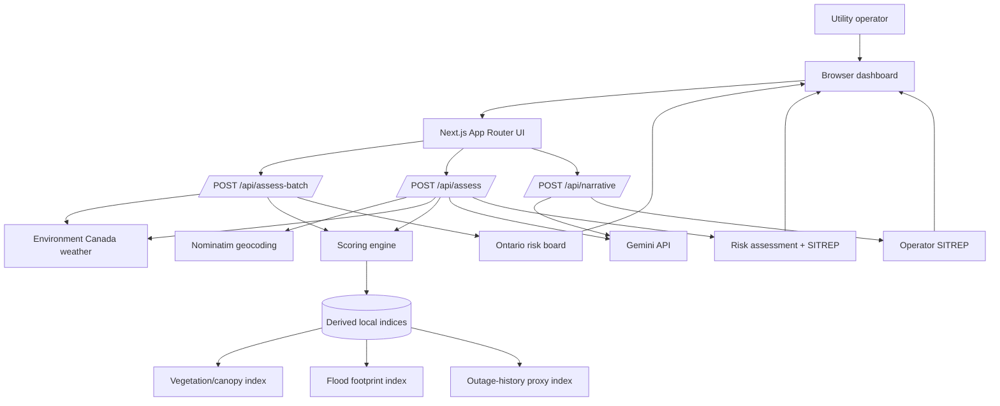
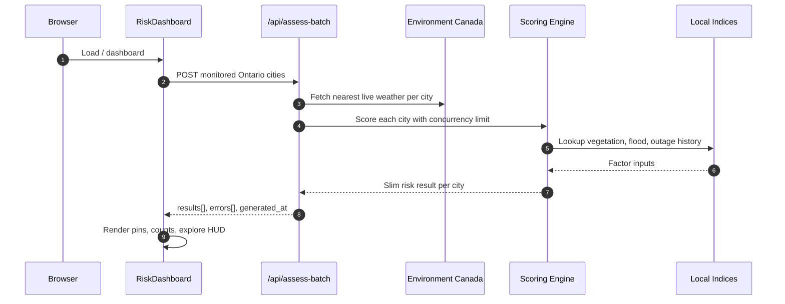
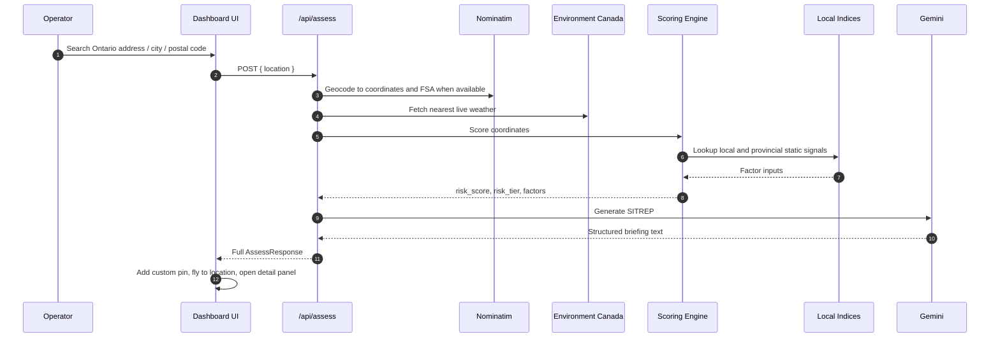
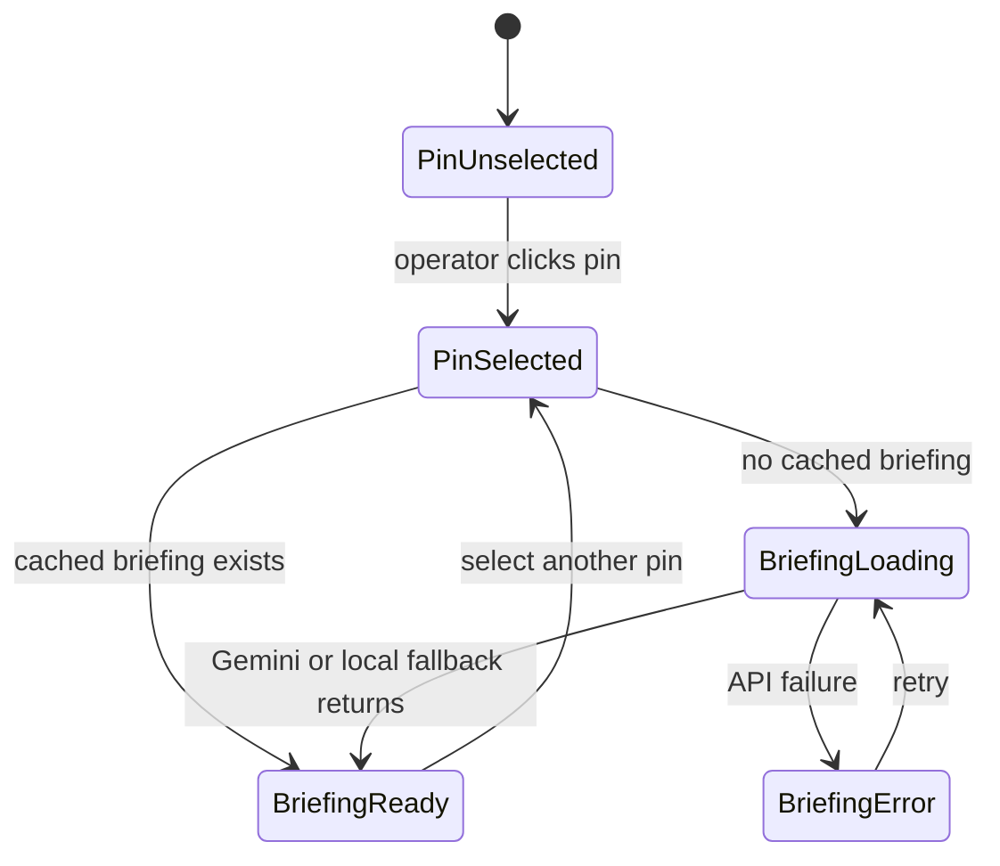
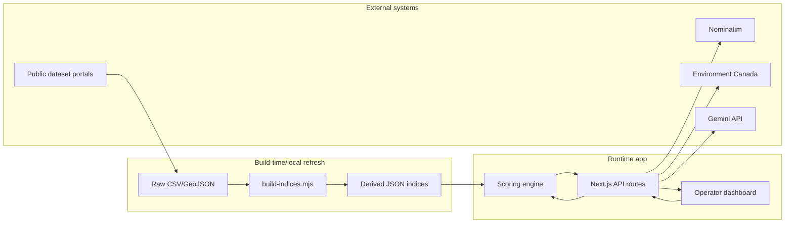
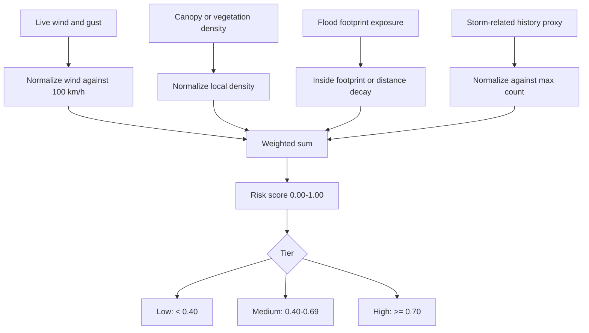
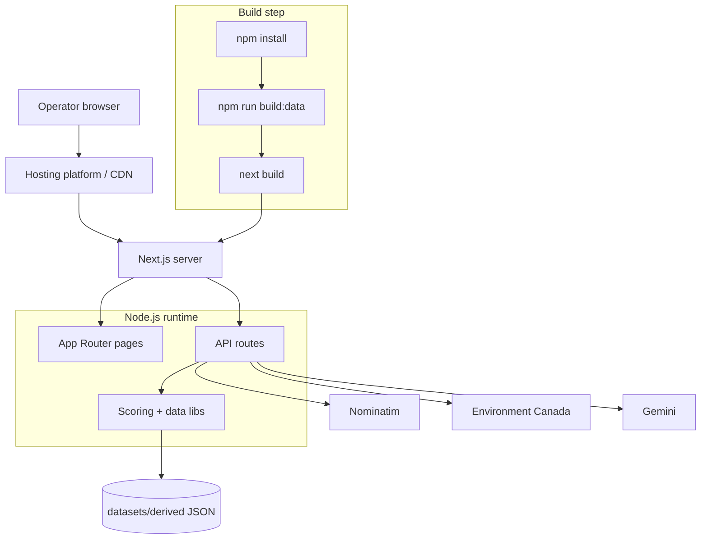
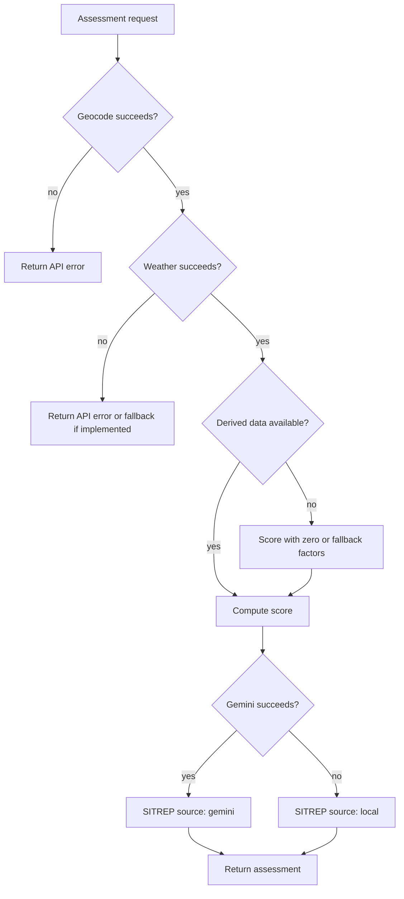
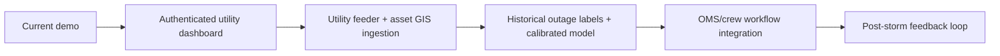

# System Design

GridGuard is a map-first outage-risk dashboard for Ontario utility operators. It combines live weather, local static geospatial indices, transparent weighted scoring, and a Gemini-generated situation report into a single operational view.

This document describes the production system shape, runtime flows, data boundaries, and main design tradeoffs.

## Goals

GridGuard is designed to answer three operational questions quickly:

- Where are outage hotspots likely right now?
- Why is a zone risky?
- What should a control-room supervisor do next?

The current implementation is a deployable Next.js application rather than a utility SCADA or outage-management system. It intentionally favors explainability and public-data reproducibility over black-box prediction.

## High-Level Architecture



## Runtime Components

### Frontend

The frontend is a Next.js client-rendered dashboard with Leaflet map ownership isolated in `components/RiskDashboard.tsx`.

Core UI responsibilities:

- Render Ontario-wide monitored city pins.
- Track map viewport and show an exploration HUD.
- Let operators add custom Ontario locations.
- Open a detail panel for any selected city or custom assessment.
- Auto-request an operator briefing when a pin is selected.
- Switch theme and notify external map state via `gg-theme-change`.

Key components:

- `TopNav`: brand, mode switch, methodology navigation.
- `RiskDashboard`: Leaflet map, batch scoring, pins, viewport-aware HUD, search.
- `BriefingReport`: parsed SITREP rendering with report metadata.
- `RiskGauge`: score/tier visualization.
- `FactorBreakdown`: factor-level explainability.

### API Layer

The API layer is implemented as Next.js route handlers running in the Node.js runtime.

Endpoints:

- `POST /api/assess-batch`: scores monitored cities without LLM generation. Used on dashboard load and refresh.
- `POST /api/assess`: geocodes a user location, fetches weather, scores risk, and returns an LLM narrative.
- `POST /api/narrative`: generates a narrative from an already scored assessment payload.

The split keeps the map load fast and avoids making one LLM call per monitored city.

### Data and Model Layer

Local static datasets are transformed into small JSON indices by `scripts/build-indices.mjs`.

Runtime lookup happens through `lib/datasets.ts`:

- Tree canopy / vegetation density.
- Flood exposure via point-in-footprint or nearest footprint distance.
- Outage-history proxy using Toronto 311 data and provincial fallbacks.

Risk calculation happens in `lib/scoring.ts` and produces:

- `risk_score`: normalized value rounded to two decimals.
- `risk_tier`: Low, Medium, or High.
- `factors`: raw values, normalized values, weights, contributions, and details.
- `storm_context`: compact weather summary.

## Request Flow: Dashboard Load



Operational notes:

- Batch concurrency is limited to avoid overloading external weather services.
- LLM calls are intentionally excluded from batch scoring.
- Partial failure is allowed: successful cities render while failures are returned in `errors`.

## Request Flow: Custom Location



## Request Flow: Briefing on Pin Selection



Briefing behavior:

- Custom `/api/assess` responses include `llm_narrative` immediately.
- Monitored city pins fetch a narrative lazily through `/api/assess` or `/api/narrative` patterns.
- `lib/llm.ts` returns `source: gemini | local` so the UI can label fallback output.

## Data Flow and Trust Boundaries



Trust boundaries:

- Browser input is untrusted and validated at API route boundaries.
- External APIs are unreliable and wrapped with timeouts where applicable.
- Local derived indices are trusted application data but should be regenerated from documented sources.
- LLM output is advisory, labelled by source, and should never be the only operational control.

## Scoring Model



Current weights:

- Wind: `0.30`
- Canopy / vegetation: `0.25`
- Flood exposure: `0.20`
- Outage-history proxy: `0.25`

Formula:

```text
risk_score = clamp01(
  0.30 * wind
+ 0.25 * canopy
+ 0.20 * flood
+ 0.25 * history
)
```

## Deployment View



Recommended production deployment characteristics:

- Node.js runtime with filesystem access to `datasets/derived`.
- Environment variable `GEMINI_API_KEY` set only on the server.
- Static raw datasets kept out of the deployed bundle unless required for refresh jobs.
- `npm run build:data` run before `next build` or as a scheduled refresh pipeline.
- Health check against `/` and a lightweight synthetic check against `/api/assess-batch` with one city.

## Failure Modes



Important behavior:

- LLM failure should not block risk scoring.
- Dataset gaps should be visible in factor details.
- Batch scoring should tolerate per-city failures.

## Current Limitations

- Public data is used as a proxy for utility-owned outage and feeder data.
- Flood data is based on NRCan product footprints, not legal floodplain maps.
- Vegetation quality varies by region; Toronto has higher-resolution canopy data than northern Ontario.
- The score is a transparent heuristic, not a trained probabilistic outage model.
- No authentication or role-based access control is implemented yet.

## Production Evolution



Highest-value production additions:

- Real feeder topology and critical-load overlays.
- Utility outage event labels for model calibration.
- Storm forecast ingestion, not only current weather.
- Audit log of operator decisions and exported reports.
- Authentication, tenant isolation, and role-based access control.
