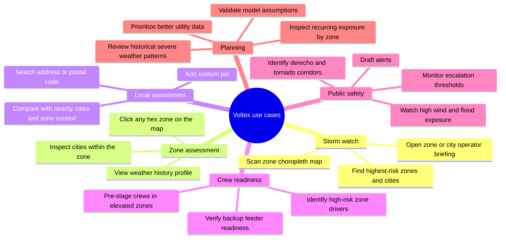
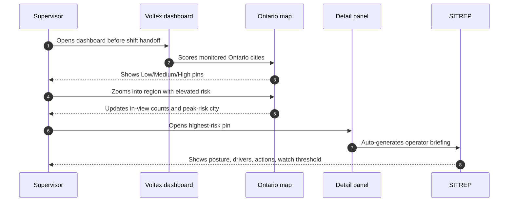
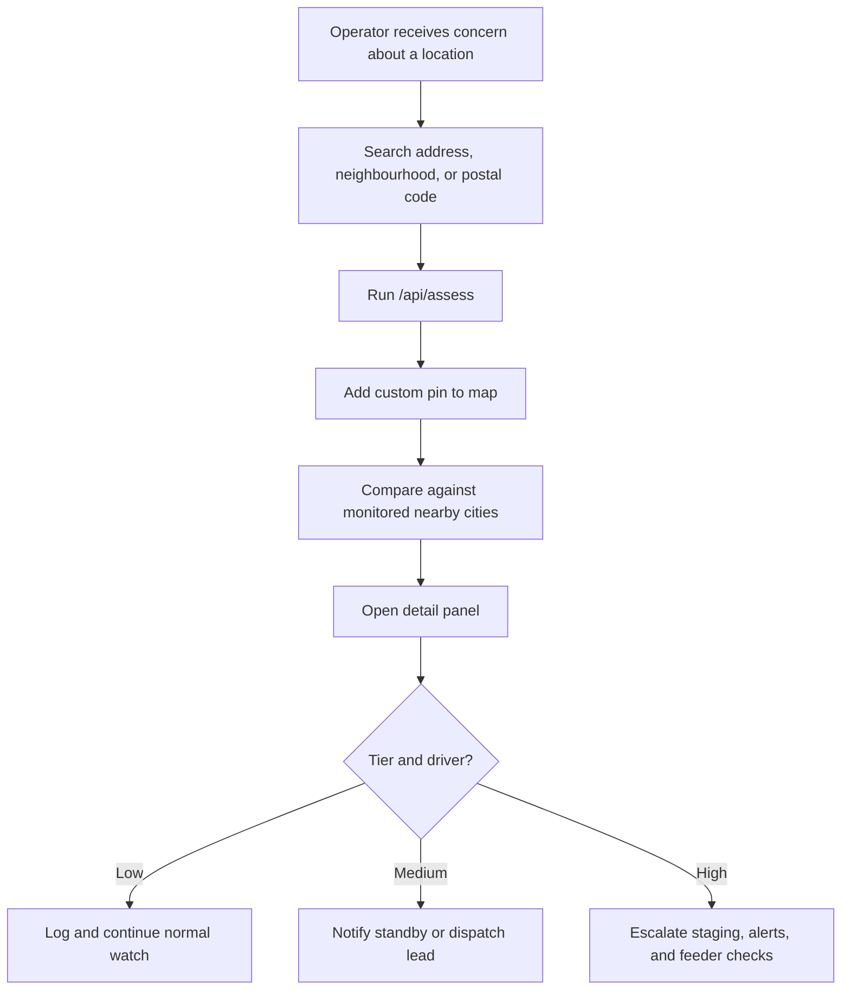
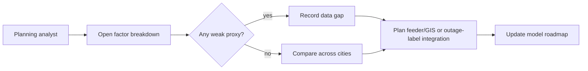
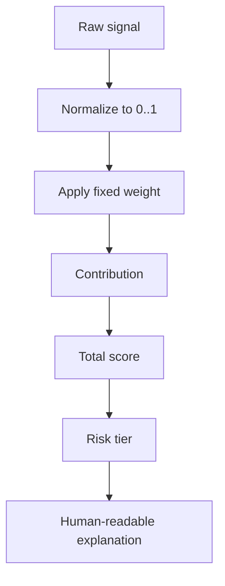

# Product Methodology and Use Cases

This document explains what Voltex does from the operator's point of view, why each signal exists, and how the output should be interpreted.

## Product Statement

Voltex helps an Ontario utility operator move from reactive outage response to proactive storm posture. It does not claim to know exactly which customer will lose power. Instead, it highlights zones where public risk signals suggest higher outage likelihood and explains what is driving that signal.

The system divides Ontario into **673 H3 hexagonal zones** (~22 km each), scores each zone using a 5-factor model (live weather, vegetation density, flood exposure, outage history, and historical severe weather patterns), and presents the results as an interactive choropleth map alongside monitored city pins.

The product value is the combination of:

- Province-wide **zone-level visual scan** — hexagons colored green → amber → red.
- Drill-down for one zone or searched location.
- Transparent **5-factor breakdown**.
- Structured **operator briefing** with zone history context.

## Primary Users

### Control-Room Supervisor

Needs a fast view of where to focus during a storm event.

Typical questions:

- Which monitored zones are highest risk right now?
- Which factor is driving the risk?
- Do we need standby crews, staging, or public messaging?

### Distribution Planning Analyst

Uses the dashboard as an explainable prototype for resilience planning.

Typical questions:

- Which areas repeatedly show vegetation or flood exposure?
- Where would proprietary feeder data improve the model most?
- Which public datasets are useful enough to keep?

### Incident Communications Lead

Uses the operator briefing as a draft for operational messaging.

Typical questions:

- What changed in the local weather signal?
- Which public-facing actions are justified?
- What should be watched over the next six hours?

## Core Use Cases

## Scenario 1: Morning Storm Briefing

Success criteria:

- The supervisor can identify the highest-risk visible zone in under one minute.
- The detail panel explains the top driver without requiring code or raw data knowledge.
- The briefing gives specific next actions rather than generic monitoring language.

## Scenario 2: Custom Address Triage

Success criteria:

- The operator receives a score, tier, factors, and briefing from one input.
- The location is preserved on the map as a custom pin.
- The output is explainable enough to justify escalation or de-escalation.

## Scenario 3: Data Quality Review

Success criteria:

- The team can see which factor came from high-quality local data and which came from fallback data.
- Model limitations are visible and documented.
- Production data acquisition is driven by observed gaps.

## Methodology

### 1. Locate the zone

For custom assessments, Voltex uses Nominatim to convert user-provided location text into coordinates. Where available, postal code information is used to derive the FSA for history lookup.

### 2. Read the current storm signal

Voltex calls Environment Canada for the nearest weather station and extracts:

- Sustained wind speed.
- Gust speed when available.
- Temperature.
- Conditions.
- Alerts and forecast summary when available.

Wind and gust are treated as immediate outage stressors because falling limbs, conductor galloping, and asset strain correlate with high wind conditions.

### 3. Join static exposure layers

Static layers are preprocessed into derived JSON indices. Runtime scoring uses these indices rather than parsing large raw CSV or GeoJSON files on every request.

Signals:

- Vegetation/canopy density: proxy for tree-line interaction risk.
- Flood exposure: proxy for access and infrastructure vulnerability.
- Outage-history proxy: public 311 and provincial reliability-style estimates where available.
- Historical severe weather: 20-year zone-level patterns including tornado events, ice storms, high wind events, severe thunderstorms, and derecho corridor exposure.

### 4. Score transparently

Every factor is normalized to `0..1`, multiplied by a fixed weight, and summed. The UI exposes raw value, normalized value, weight, contribution, and detail text for all **5 factors**.

### 5. Generate a structured briefing

Gemini receives only the structured assessment payload, not arbitrary page state. The prompt enforces a SITREP format:

- `POSTURE`: risk tier and primary driver.
- `DRIVERS`: top contributing factors with values.
- `ACTIONS`: concrete operational actions.
- `WATCH`: escalation/de-escalation threshold for the next six hours.

If Gemini is unavailable, a deterministic local fallback produces a briefing and labels the source accordingly.

## Interpretation Guide

### Low Risk

Typical meaning:

- No severe weather signal or only weak local exposure.
- Normal control-room posture is likely enough.

Recommended operator stance:

- Keep normal monitoring.
- Watch for sudden wind/gust changes.
- Avoid unnecessary crew escalation.

### Medium Risk

Typical meaning:

- One strong factor or several moderate factors are present.
- Conditions justify readiness but not full response posture.

Recommended operator stance:

- Put on-call crews and dispatch leads on notice.
- Check feeder backup readiness in the affected region.
- Prepare public messaging if forecast/alerts worsen.

### High Risk

Typical meaning:

- Strong weather signal plus local vulnerability, or one extreme exposure factor.
- Zone may sit in a known severe weather corridor (tornado alley, derecho path, ice storm zone).
- Conditions justify proactive response planning.

Recommended operator stance:

- Pre-position crews near likely problem corridors.
- Verify critical feeders, backup routes, and restoration staging.
- Consider targeted public alerts.
- Monitor watch thresholds closely.
- Reference zone weather history for context on recurring patterns.

## What Voltex Is Not

Voltex is not:

- A replacement for SCADA, OMS, ADMS, or utility GIS.
- A legal floodplain determination tool.
- A trained feeder-level outage prediction model.
- A source of truth for customer outage counts.
- An autonomous dispatch system.

Voltex is an explainable decision-support layer that shows where public risk signals point and why.

## Production Acceptance Criteria

Before using a Voltex-like tool operationally, a utility should require:

- Authenticated access with role separation.
- Utility-owned outage labels for calibration.
- Feeder, asset, and critical-customer GIS overlays.
- Forecast weather ingestion, not only current conditions.
- Operator audit logs and exportable reports.
- Data freshness indicators for every source.
- Model validation against historical storm events.
