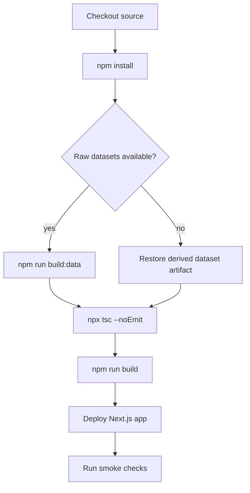
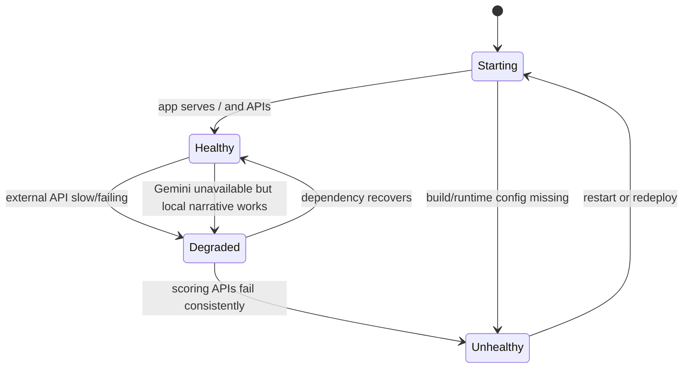
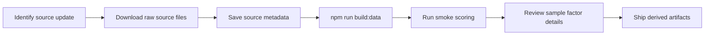
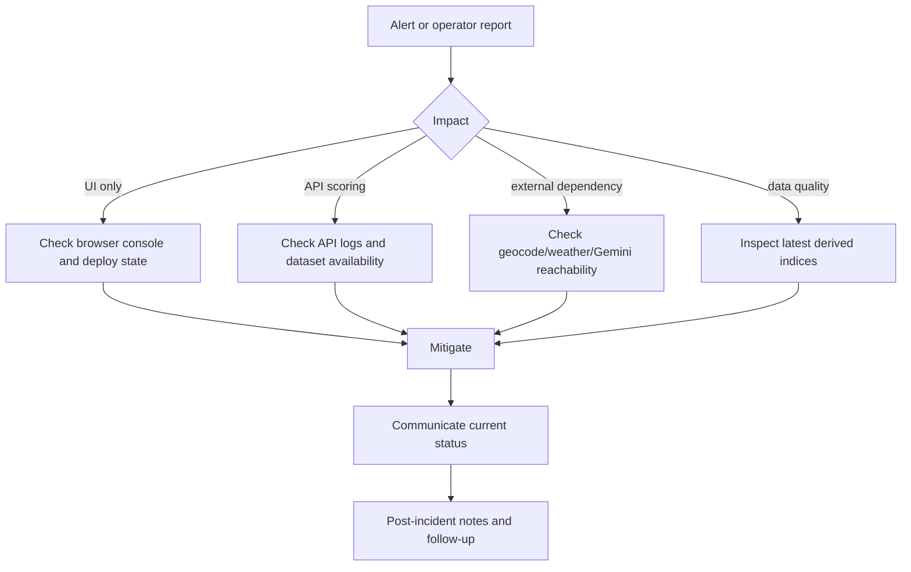

# Operations Runbook

This runbook describes how to configure, run, verify, troubleshoot, and maintain Voltex in a production-like environment.

## Service Summary

Voltex is a Next.js 16 application with server-side API routes and a client-side Leaflet dashboard.

Runtime dependencies:

- Node.js runtime supported by Next.js 16.
- Filesystem access to `datasets/derived`.
- Network access to Nominatim, Environment Canada, and optionally Gemini.
- Optional `GEMINI_API_KEY` for live operator briefings.

Critical commands:

```bash
npm install
npm run build:data
npm run build
npm run start
```

Local development:

```bash
npm run dev
```

## Configuration

Required:

- No secret is required for scoring and map display.
- Derived dataset files must exist under `datasets/derived` for full scoring fidelity.

Optional:

- `GEMINI_API_KEY`: enables Gemini-generated operator briefings.

If `GEMINI_API_KEY` is absent or Gemini fails, the application falls back to a local deterministic narrative. This is expected behavior and should not be treated as a scoring outage.

## Build and Deploy Flow



Production recommendation:

- Store derived dataset artifacts as build artifacts or generate them in CI.
- Do not require raw multi-megabyte datasets at runtime unless refresh-in-place is intentionally supported.
- Run `npm run build:data` before `npm run build` whenever source datasets change.

## Health Checks

### Basic app check

```bash
curl http://localhost:3000/
```

Expected result:

- HTTP `200`.
- HTML response.

### Batch scoring check

```bash
curl -X POST http://localhost:3000/api/assess-batch \
  -H "Content-Type: application/json" \
  -d '{"cities":[{"name":"Toronto, Ontario","label":"Toronto","lat":43.6532,"lng":-79.3832}]}'
```

Expected result:

- HTTP `200`.
- `results` contains one scored city.
- `errors` is empty or contains a clear external dependency error.

### Zone assessment check

```bash
curl -X POST http://localhost:3000/api/assess-zones \
  -H "Content-Type: application/json" \
  -d '{}'
```

Expected result:

- HTTP `200`.
- `zones` contains scored H3 hex zones with boundaries.
- `summary` shows high/medium/low counts.

### Custom assessment check

```bash
curl -X POST http://localhost:3000/api/assess \
  -H "Content-Type: application/json" \
  -d '{"location":"Toronto, Ontario"}'
```

Expected result:

- HTTP `200`.
- Response includes `risk_score`, `risk_tier`, `factors` (5 factors), `weather`, `generated_at`, `llm_narrative`, `llm_source`, and `zone` context.

## Operational States



Healthy:

- `/` returns `200`.
- `/api/assess-batch` returns scored results.
- `/api/assess-zones` returns scored zones with boundaries.
- Map renders with zone choropleth and city pins.

Degraded:

- Gemini fallback is in use.
- Some batch cities fail but others render.
- Zone scoring partially fails but some zones render.
- Weather or geocoding is slow but not fully unavailable.

Unhealthy:

- App route fails to load.
- Scoring APIs fail for all cities.
- Zone assessment returns no zones.
- Derived datasets are missing and fallback behavior is insufficient.

## Troubleshooting

### Dashboard loads but no pins appear

Likely causes:

- `/api/assess-batch` failed.
- Environment Canada requests are blocked or timing out.
- Derived dataset files are missing or malformed.

Actions:

1. Check browser network tab for `/api/assess-batch` and `/api/assess-zones`.
2. Run the batch scoring and zone assessment curl checks.
3. Inspect server logs for dataset load or weather fetch errors.
4. Verify `datasets/derived` exists and contains generated JSON files (including `ontario-hex-grid.json` and `historical-severe-weather.json`).
5. Re-run `npm run build:data` if raw datasets are available.

### Map loads but no zone colors appear

Likely causes:

- `/api/assess-zones` failed.
- `datasets/derived/ontario-hex-grid.json` or `datasets/derived/historical-severe-weather.json` is missing.
- Layer mode is set to "Cities" (zones are hidden).
- Environment Canada requests are blocked or timing out.

Actions:

1. Check browser network tab for `/api/assess-zones`.
2. Run the zone assessment curl check.
3. Verify dataset files exist under `datasets/derived`.
4. Check that the layer toggle is set to "Both" or "Zones".
5. Re-run `npm run build:data` to regenerate hex grid and weather history.

### Search fails for a valid Ontario location

Likely causes:

- Nominatim unavailable or rate-limited.
- Location text is ambiguous.
- Network egress is blocked from the server.

Actions:

1. Retry with a city plus province, for example `Kingston, Ontario`.
2. Check `/api/assess` response body for the error message.
3. Confirm server can reach Nominatim.
4. Consider adding an internal geocoder or cached gazetteer for production.

### Briefing says local fallback

Likely causes:

- `GEMINI_API_KEY` is not set.
- Gemini API returned an error.
- Request timed out.

Actions:

1. Confirm `GEMINI_API_KEY` is configured in the server environment.
2. Check API logs for Gemini status or timeout errors.
3. Treat risk scoring as valid if factors and score are present.
4. Use fallback text as advisory, not as proof Gemini is healthy.

### Light or dark map theme looks wrong

Likely causes:

- Browser has stale hot-reload state.
- `vx-theme` in localStorage conflicts with expected theme.
- Carto tile layer did not swap after theme toggle.

Actions:

1. Hard refresh the browser.
2. Clear `localStorage.vx-theme` and reload.
3. Toggle theme once to dispatch `vx-theme-change`.
4. Confirm Leaflet tile URLs use `light_nolabels` for light and `dark_nolabels` for dark.

### Hydration warning on theme

Expected context:

- The server renders `data-theme="dark"`.
- The boot script applies stored light/dark preference before hydration.
- `<html suppressHydrationWarning>` is used to silence this intentional difference.

Actions:

- If only `data-theme` differs, no action is required.
- If additional markup differs, inspect components for client-only data during server render.

## Dataset Refresh Runbook



Refresh steps:

1. Download or update raw datasets under `datasets/` according to `datasets/README.md`.
2. Keep raw large files out of git unless explicitly required.
3. Run `npm run build:data` (chains `build-indices`, `build-hex-grid`, and `build-weather-history`).
4. Run typecheck and build.
5. Test at least one Toronto location and one northern Ontario location.
6. Verify zone count in `ontario-hex-grid.json` (expected ~673 hexes).
7. Compare factor details for obvious regressions.
8. Deploy derived JSON indices with the application.

## Monitoring Recommendations

Application signals:

- Request rate and latency for `/api/assess`.
- Request rate and latency for `/api/assess-batch`.
- Request rate and latency for `/api/assess-zones`.
- Error rate by external dependency: geocoding, weather, Gemini.
- Gemini fallback rate.
- Batch city failure count.
- Zone scoring failure count.
- Dataset load failure count.

User-experience signals:

- Time to first map pins.
- Time to zone choropleth render.
- Time to custom assessment completion.
- Time to briefing completion.
- Browser runtime errors from Leaflet or hydration.

Data quality signals:

- Percent of assessments using provincial vegetation fallback.
- Percent of assessments with no FSA.
- Percent of assessments with no outage-history record.
- Weather station distance, if exposed later.

## Security and Privacy Checklist

Current posture:

- No authentication is implemented.
- No user accounts are stored.
- Location search text is sent to server and to Nominatim.
- Gemini receives structured assessment payloads.

Before production:

- Add authentication and role-based access.
- Avoid sending sensitive customer addresses to third-party services without policy approval.
- Replace public Nominatim with approved geocoding infrastructure or a cached gazetteer.
- Add rate limiting to API routes.
- Keep `GEMINI_API_KEY` server-only.
- Add request logging with sensitive-location redaction.
- Add dependency timeout and retry budgets.

## Incident Response



Severity guidance:

- Sev 1: scoring unavailable for all users or dashboard cannot load.
- Sev 2: custom search unavailable or batch map mostly fails.
- Sev 3: Gemini unavailable but local fallback works.
- Sev 4: visual/theme issue that does not block scoring.

## Backup and Recovery

What to back up:

- Source code repository.
- `datasets/metadata` source manifests.
- Derived dataset artifacts.
- Deployment environment variables.

Recovery path:

1. Re-deploy the last known-good build.
2. Restore derived dataset artifacts.
3. Verify `/` and `/api/assess-batch`.
4. Verify a custom `/api/assess` request.
5. Confirm map pins and briefing behavior in browser.
